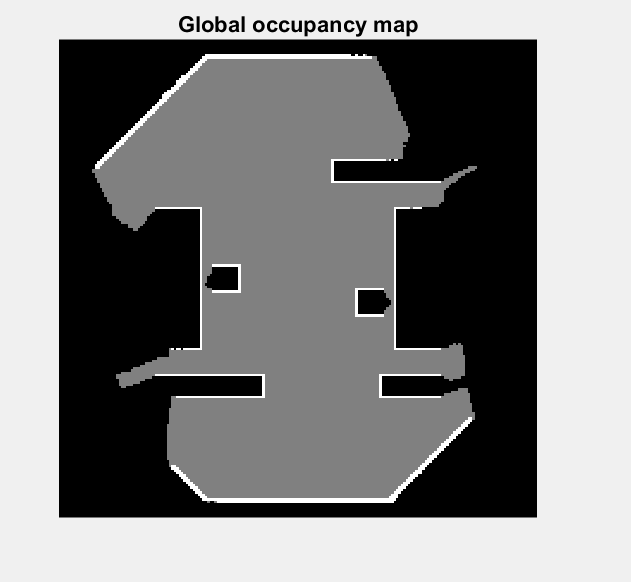
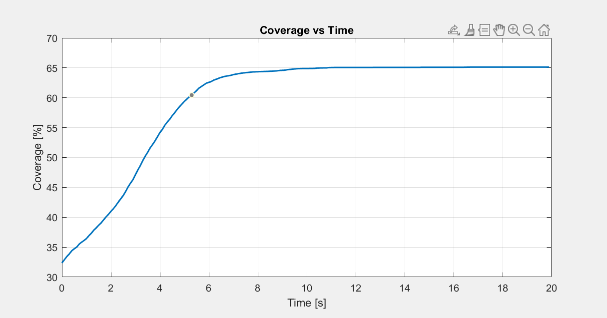
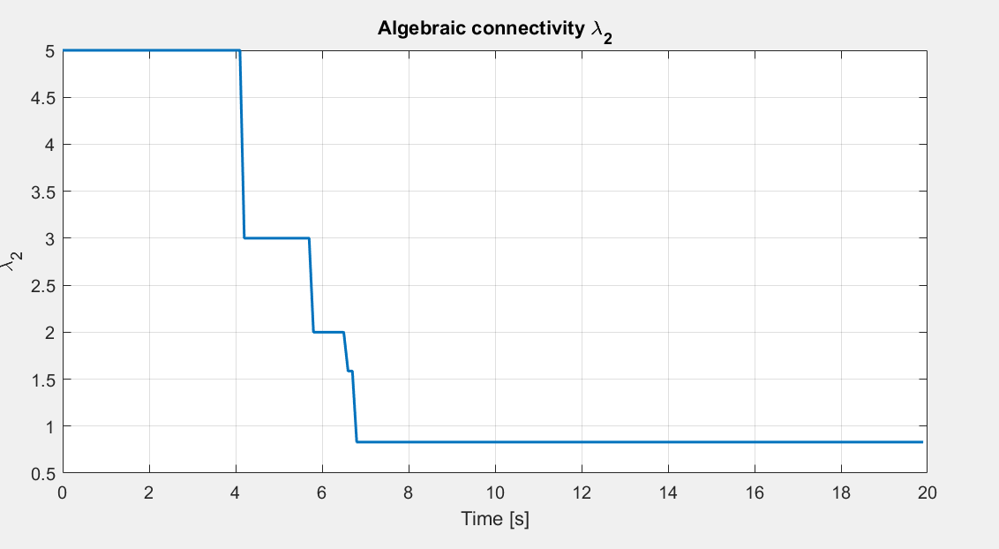
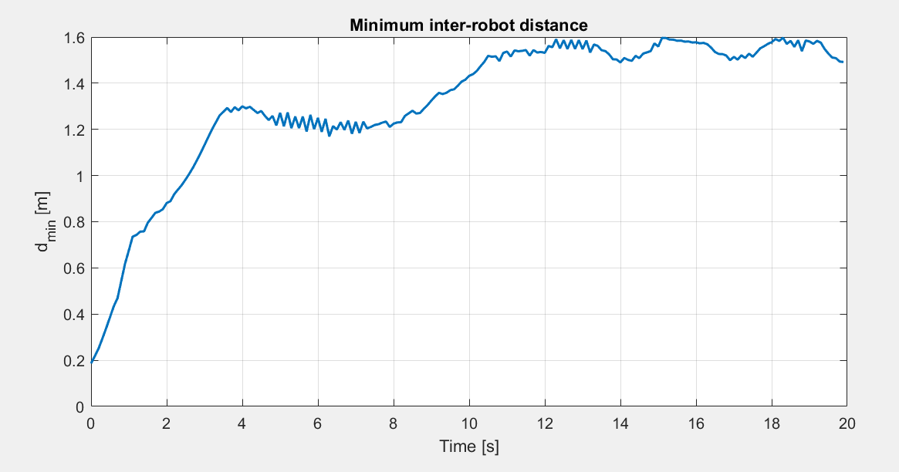

# Connectivity-Constrained Swarm Exploration

A decentralized multi-robot swarm system for distributed exploration and area coverage under communication connectivity constraints.  
Implemented in Webots using TurtleBot3 robots with occupancy-grid mapping, reactive obstacle avoidance, and map fusion.

---

## Overview

This project implements a connectivity-constrained swarm exploration framework where multiple robots:

- Explore an unknown bounded environment
- Maintain communication connectivity
- Avoid collisions with obstacles and other robots
- Build and fuse occupancy-grid maps collaboratively

The system is designed around four core properties:

1. **Safety** – Robots avoid collisions with walls, obstacles, and other robots.
2. **Connectivity** – The communication graph remains connected during exploration.
3. **Coverage** – The explored area monotonically increases over time.
4. **Map Consistency** – Local maps converge via distributed fusion.

---

## System Architecture

Each robot runs a fully decentralized controller consisting of:

- Differential-drive odometry
- LiDAR-based obstacle avoidance
- Voronoi-based target sampling
- Occupancy-grid mapping
- Entropy-driven exploration
- Communication-based neighbor tracking
- Connectivity-aware target override
- Periodic map broadcasting and fusion

No centralized coordinator is used.

---

## Results

### Swarm Exploration

### Coverage Over Time

### Connectivity Maintenance

### Collision over time

---

## Repository Structure

